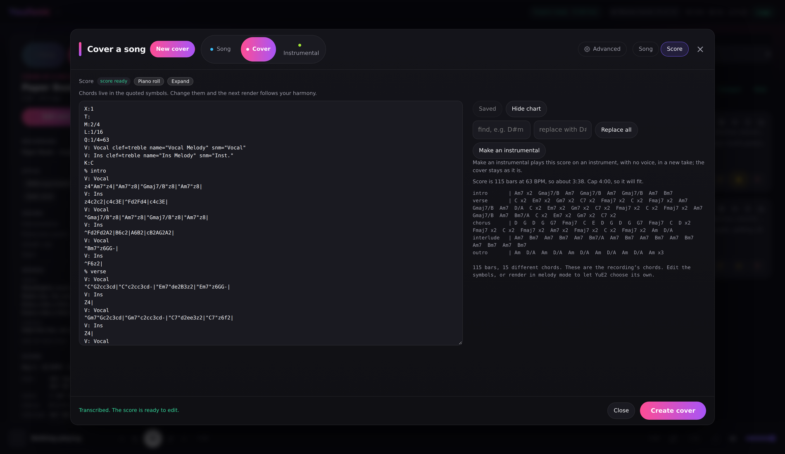
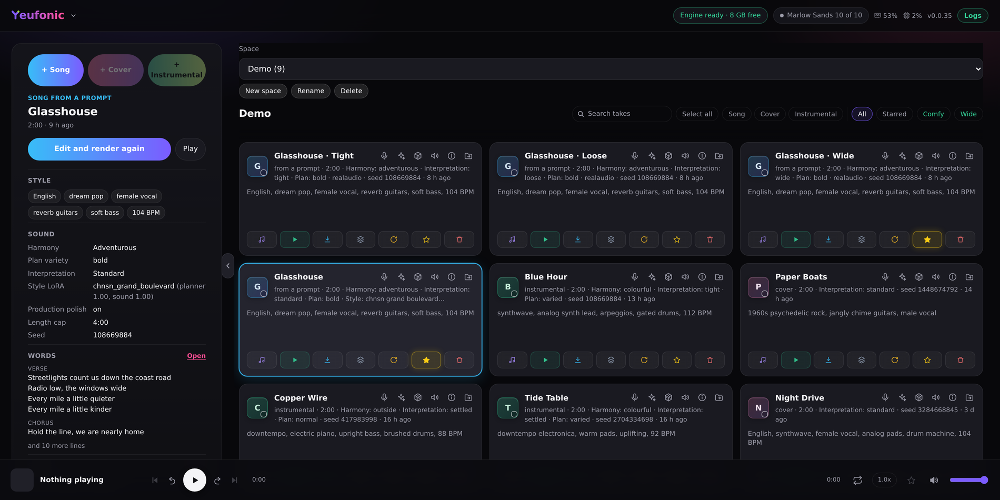
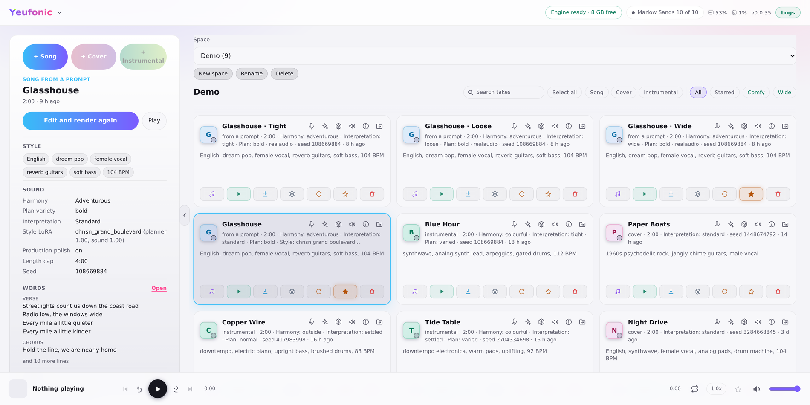
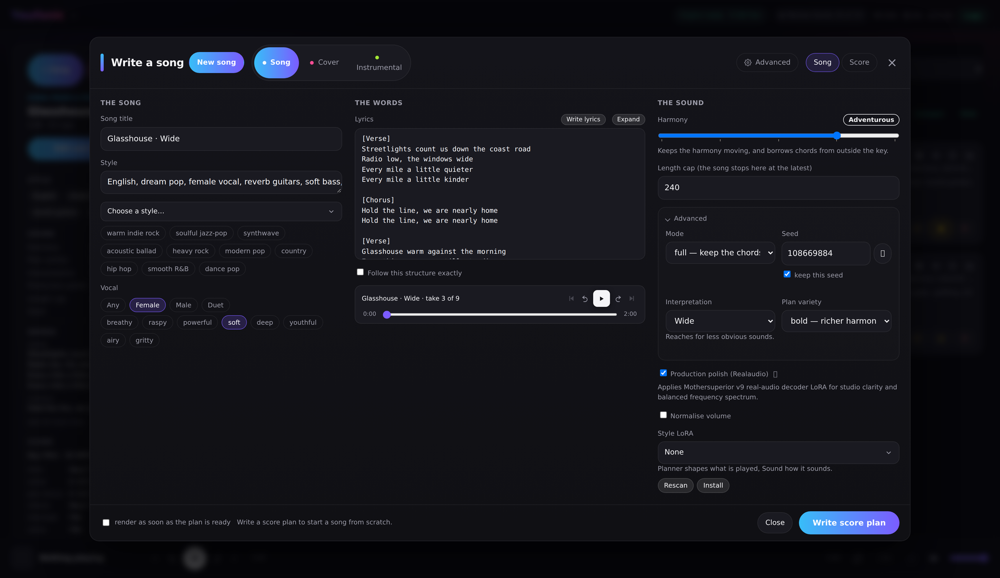
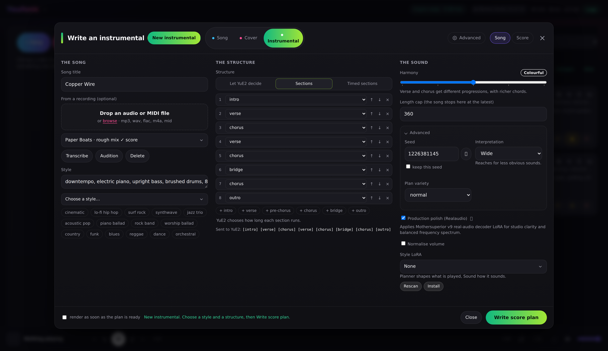
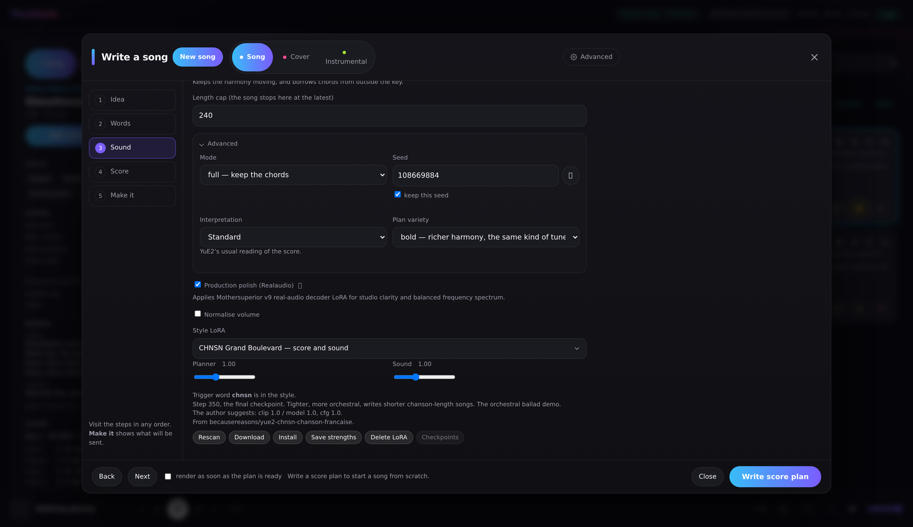

#  Yeufonic

> **YuE2 Studio is now Yeufonic.** It's the same app under a new name.
> The old repository, [YuE2gen-studio](https://github.com/dynamohum/YuE2gen-studio), 
> is archived and gets no more updates. If you use YuE2 Studio, your library, settings, LoRAs
> and models all come across: see [Moving from YuE2 Studio](#moving-from-yue2-studio).

A web interface for [YuE2](https://github.com/multimodal-art-projection/YuE), the open music
model. Write a song from a prompt, or cover your own recording. Create a local LoRA trained on 
a corpus of music. Edit the score either way, then pull the stems out of the result.

- **Song from a prompt:** write a score plan from a style and lyrics, edit it, render it.
- **Cover a recording:** transcribe your song, change its melody and chords, render a new version.
- **Instrumentals:** build the structure section by section, or play a recording's score.
- **MIDI import for covers and instrumentals:** MIDI editing with piano roll and sf2 (experimental).
- **Style LoRAs:** use published ones, or train your own from a folder of songs.
- **Lyrics:** draft them from a sentence, or extract them from a recording.
- **An MCP server (off by default):** let an AI agent such as Claude Code make songs, covers and instrumentals, play them and tidy the library, in your own words. See [Using Yeufonic from an AI agent](app/static/guide.md#using-yeufonic-from-an-ai-agent-mcp).
- **Stems:** split any take into vocals, drums, bass and more, or into vocals and a backing track.
- **A library:** spaces, stars, and every take's settings kept so it can be made again.
- **A take panel and an editor:** the left panel shows how the selected take was made, and a large
  window, in three columns or as steps, is where takes are made and changed.
- **Windows without Docker:** an installer that sets it all up natively, for people who would
  rather not use Docker.

Everything runs on one machine, in two parts: the app and the engine. With Docker they are two
containers; the Windows installer runs the same two natively. No cloud and no accounts; an
external LLM for lyrics is optional.

    browser  ->  app  (this project)                 http://localhost:8090
                   |
                   v
                 engine  (ComfyUI + the YuE2 nodes)  owns the GPU

If you enjoy using this app, then please give it a ⭐️, and if you want to buy me a coffee, then please use [Buy Me a Coffee](https://buymeacoffee.com/dynamohum).

## What it looks like

Covering a recording: the editor window on its Score page, with the transcribed score and its chord
chart:

[](https://raw.githubusercontent.com/yeufonic/yeufonic/main/docs/screenshots/full/cover-a-recording.png)

The library with **Wide** and **Comfy** on, and the take panel on the left showing how the selected
take was made. The cards are wider, with room for more of the title and prompt; hover over a card's title, settings or
prompt to read all of it. Compact cards are what you start with, and the chevron beside the panel
folds it away:

[](https://raw.githubusercontent.com/yeufonic/yeufonic/main/docs/screenshots/full/comfy-layout.png)

The same in the **Light** theme, one of five in Settings → Theme:

[](https://raw.githubusercontent.com/yeufonic/yeufonic/main/docs/screenshots/full/light-theme.png)

Writing a song from a prompt, in the editor's three columns:

[](https://raw.githubusercontent.com/yeufonic/yeufonic/main/docs/screenshots/full/write-a-song.png)

Writing an instrumental, with the structure built section by section:

[](https://raw.githubusercontent.com/yeufonic/yeufonic/main/docs/screenshots/full/instrumental.png)

To hear what it makes, there are example songs in **[examples](examples/)**, made with style LoRAs
trained in the app. They play on that page, and the MP3s can be downloaded.

## What it does

- **Cover a recording.** Upload a song, transcribe it once, edit the melody and chords, render.
  Or pick a song from one of your corpora: its analysis already has the score and the words.
  The transcription is cached per recording, so re-rendering skips straight to the music.
- **Hear what the recording sings.** A cover needs lyrics. **Extract lyrics** separates the vocal,
  listens to it and lays the lines under the sections of the score. It is asked for rather than
  done every time. The vocal is separated, and its words heard, on the GPU when the engine has Demucs and Whisper, otherwise on the CPU.
  Configure Yeufonic to use an external LLM for even greater accuracy.
- **Song from a prompt.** Write a score plan from style and lyrics, read it, repair it, render it.
  A new plan costs seconds, so a bad melody is cheap to discard.
- **Same tune, new words.** Change the words of a take you like, keep **Keep this tune** ticked,
  and its score is sung with them as a new take with the same seed. A new plan would be a new tune.
- **Choose how adventurous the chords are.** YuE2 tends to write one four-chord loop for a whole
  song. The Harmony slider, from Familiar to Outside, pushes the planner towards chords it has not
  just used, without breaking the song's structure.
- **Instrumentals.** A third mode: style and structure in, a song with no vocal out. Build the
  structure section by section, time each section, or let YuE2 decide. Used in combination with 
  LoRA ar_lora_inst_v3abc_comfyui.safetensors by Mothersuperior. Or choose a recording, and its
  score is played, sections and all, with any sung melody played by an instrument.
- **Draft lyrics from a sentence.** Say what the song is about and pick a structure. Gemma 4
  writes a first draft in YuE2's section layout, or you can call an external LLM if you
  set one up in Settings.
- **Choose the interpretation.** Six ways to render the same score, from Tight to Wide, and
  **Variations** renders one take in the others, so you can compare them by ear.
- **Choose the voice.** Chips set female, male or duet and a voice character. YuE2 has no vocal
  parameter, so the chips write into the style text, and the take keeps the choice.
- **Fine-tune a take.** An **Advanced** panel in the editor sets, per take, the key and tempo the
  plan is moved to, the render's diffusion steps, the planner's chord habits, and the loudness and
  fade of the finished file. **Reset to defaults** puts them back.
- **Train a LoRA from your own songs.** Prepare a corpus from a folder of songs, by one artist,
  in one genre or by a few similar artists, and train a style LoRA from it. It works best in a
  song from a prompt, where the LoRA writes the tune. See Training a LoRA below.
- **Hear every step of a LoRA's training.** A training run keeps a checkpoint every 50 steps.
  **Checkpoints** renders the same song once on each of them, with one seed, as takes named after
  their step. Each has its own taste in melody and structure, while keeping the style and sound
  the LoRA was trained on.
- **Lean on a style LoRA.** Drop other people's trained files into `models/loras/` and pick one
  from a list, with separate strengths for the score and the sound. See Style LoRAs below.
- **Read the score three ways.** Expand opens a full size editor, with the chord find and replace
  beside it, and three views below: a chord chart, real staff notation, and the lyrics with each
  section's chords. Chord symbols sit in double quotes. Fix one everywhere with find and
  replace, or edit any single chord by hand in the score.
- **Hear a plan, and export it.** The Score window's **Notation** tab plays the plan as you have
  edited it, with the note it is on picked out and each line played with an instrument the style
  names — a guitar, a piano, strings, a synth — and drums when the style asks for them. **Download
  MIDI** saves the score for a DAW, one track for each part: the vocal and instrument lines, the
  chords with their bass, and drums when the style asks for them, each with its General MIDI instrument.
- **MIDI import and audition (Experimental).** Drop a Standard MIDI file (`.mid`, `.midi`) into Cover
  mode to generate different, often off-the-wall takes of original tunes. The app parses tracks into
  vocal melody, accompaniment, and chords, extracts embedded lyrics, and provides high-fidelity audio
  audition via FluidSynth and bundled General MIDI SoundFonts (`.sf2`).
- **Stems.** Extract vocals, drums, bass, other, and optionally guitar and piano, on the GPU in the
  engine's queue when it has Demucs, otherwise on the CPU. Or split into just the vocals and the
  instruments, for a backing track.
  Download them singly or as a zip.
- **Spaces.** Keep takes apart by project: a space per song, per album, or for sketches. Create,
  rename and delete spaces, and move a take from one to another.
- **Try more, and Compare.** Render a take again as a set of new seeds, or at other LoRA planner
  strengths, then play the ones you tick against each other from the same point in the song, with
  matched loudness and an optional blind listen.
- **A library.** Every take keeps its score, style, lyrics, seed and settings, so it can be
  reproduced, reworked, starred or deleted. Search by title, style, lyrics or LoRA, in one space or
  all of them. Tick several cards and one button clears them all.
- **A player for reviewing takes.** A real waveform you can click to seek, previous and next through
  the library, ten second skips, repeat, speed and volume, with keyboard shortcuts.
- **Told when a newer version is out.** Every four hours the app asks its own site whether a later release
  exists — one request, nothing else leaves the computer. When there is one, a quiet pill beside the
  version and **Check for updates** in the menu offer the installer (Windows) or the two commands
  that update a Docker copy. Either can be switched off in Settings.

## Style LoRAs

A LoRA is a small file that leans YuE2 towards a sound: a genre, a tradition, a production style.
Put one in `models/loras/` and press **Rescan**, or use **Install**, and it appears in the **Style
LoRA** list in the editor's sound settings, in all three modes. **Download** hands one to someone
else. Here it is in the editor's other layout, steps, on the Sound step:

[](https://raw.githubusercontent.com/yeufonic/yeufonic/main/docs/screenshots/full/style-lora.png)

These are usually files other people have published, e.g. on Hugging Face, and
the app's job is to make them usable without knowing how they are put together:

- **Two strengths, because a LoRA has two halves.** *Planner* shapes what is played: the score
  plan — form, harmony, phrasing — and then the music a render writes from it. *Sound* shapes the audio. A file that
  holds only one half has the other strength greyed out, and a file this engine cannot load is
  named as such in the list rather than failing quietly inside a render.
- **The trigger word is handled for you.** Most of these files do very little unless the style text
  starts with the word they were trained on. Choosing a LoRA puts its trigger at the front of the
  Style, switching swaps it, and None takes it away.
- **Each one says what it is.** The list is grouped by publisher, and every entry carries its
  author's own description and suggested strengths, on the option and in a tooltip. A LoRA of your
  own gets the same by writing a `.txt` beside it: first line the name, a `Trigger:` line, then the
  description.

The [user guide](app/static/guide.md#style-loras) has the detail, including links to third-party LoRAs
that you can import to Yeufonic.

## Training a LoRA

Open **Corpora** from the menu. The app prepares a **corpus**: a folder of songs. Typically this
would be of an artist or genre to use when training your LoRA. Each track gets its vocal
separated, its key, tempo and sections found and its lyrics drafted. You then export it as a
training set, and train a style LoRA from it. **Run all** does the three one after the other, for
a big corpus you would rather not wait on. Training holds the GPU until it finishes, and the
LoRA appears in the Style LoRA list, with a style chip for each song it learned from. Training
also saves a checkpoint every 50 steps, folded under its LoRA in the list, and a corpus's **Edit**
form lists them run by run, with their sizes, to delete the ones you don't need. Each gives its own
take on the style. With the LoRA chosen, **Checkpoints** beside **Delete LoRA** makes what the
panel would make once on each of them, with one seed, so you can compare them by ear. To save the
space, **Training checkpoints** in Settings can delete them when training ends. To share a LoRA, press **Download** under the picker: the zip carries
its chips, and the other person adds it with **Install**.

Your corpora, one corpus per artist or genre:

[](https://raw.githubusercontent.com/yeufonic/yeufonic/main/docs/screenshots/full/corpora.png)

One corpus, analysed, exported and trained, with each song's key and tempo:

[](https://raw.githubusercontent.com/yeufonic/yeufonic/main/docs/screenshots/full/corpus.png)

It does most in a song from a prompt, where the LoRA writes the tune. It usually works best with Planner and Sound up to
about 0.70 but experiment to find the sweet spot and save them as a default for the LoRA. In a cover your recording sets the melody, so
you may keep Sound nearer to 0.50. The [user guide](app/static/guide.md#corpora-and-training-a-lora) walks
through it.

Every analysed song in your corpora is ready to cover: pick it from the recording list, choose a
LoRA, and render, with no transcribing or lyric extraction to wait for. The style fills in with
the one the song was learned with. See
[Covering a song from a corpus](app/static/guide.md#covering-a-song-from-a-corpus).

Training needs about 12.5 GB of GPU memory, most of it while it prepares the songs, and the Train
window warns when less than that is free.

How many steps a run trains for, and how much it can learn, can be changed: see
[Environment variables](#training).

It is on by default. `TRAINING_ENABLED: "0"` on the app takes it out, and `WITH_TRAINER=0` leaves
the trainer out of the engine image.

## On Windows, without Docker

A small installer sets Yeufonic up natively on Windows.
It needs no Docker, no WSL and no administrator rights. Running a newer installer will automatically update an existing
installation, and running it again is also how you change the model size (below).

**You need:**

- Windows 10 22H2 or Windows 11, 64-bit.
- An NVIDIA graphics card, RTX 30-series or newer, with a recent driver. 12 GB of video memory is
  recommended, and 8 GB works for making songs (with 6 GB or less, choose the low-memory model: see
  [Choosing a model size](#choosing-a-model-size)). Training a LoRA needs more: about 12.5 GB free
  while it prepares the songs, so 16 GB is the practical minimum, and an 8 GB card can't train
  (it can still use LoRAs trained elsewhere). AMD and Intel graphics are not supported.
- 16 GB of RAM and about 30 GB of free disk, more as your library grows.
- An internet connection for about 27 GB of downloads (23 GB with the smaller low-memory model, see
  [Choosing a model size](#choosing-a-model-size)), most of it the models. The score preview
  fetches its own note samples as they are played, about 7 MB for each instrument.

The installer checks all of this before it downloads anything.

**Installing:**

1. **Download** `Yeufonic-Setup-<version>.exe` from the
   [latest release](https://github.com/yeufonic/yeufonic/releases/latest).
2. **Run it.** The installer is not signed yet, so Windows may say *Windows protected your PC*.
   Choose *More info*, then *Run anyway*.
3. **Choose your options:**
   - Accept the terms.
   - Choose the **YuE2 model size**: *Full quality* (the default, and what we recommend) or *Low
     memory*, a smaller model for graphics cards with little video memory. You get one or the other.
     To change your mind later, run the installer again and pick the other on this page; it downloads
     the new one and removes the old. [Choosing a model size](#choosing-a-model-size) says how to decide.
   - Choose whether to include **Lyric drafts (Gemma 4)**. Leave it out if you will set up an
     external LLM; that saves an 8 GB download.
   - Keep or change the folder. The default is `%LOCALAPPDATA%\Programs\Yeufonic`.
4. **Wait for setup.** A setup window checks the PC, then downloads each part from its own
   publisher and checks it against its published checksum. The window may open behind the
   installer. If a download breaks off, run the installer again: it carries on from where it
   stopped.
5. **Start Yeufonic** from the Start menu or the desktop. It opens in a window of its own within a
   few seconds, while the engine finishes starting. Its icon sits by the clock: click it to open
   the window, and right-click it to quit. Closing the window leaves Yeufonic running there, so
   a render or training carries on. *Yeufonic (with console)* in the Start menu starts it with a
   window that reports as it goes, for when something needs diagnosing.

**Ports and folders:** a `settings.ini` in the install folder changes them. Create it with a
`[yue2]` section and only the lines you need, then start Yeufonic again:

```ini
[yue2]
app_port = 8090
engine_port = 8188
data_dir = D:\YuE2 library
import_roots = D:\Music
open_browser = yes
window = app
engine_args = --disable-dynamic-vram
```

`engine_args` adds switches to the command that starts the engine (ComfyUI), for when it misbehaves on a particular PC;
its own `--help` lists them. Leave it out unless you need it.

`data_dir` is where the library lives (by default, `data` in the install folder). `import_roots`
is the folders a corpus may be built from, separated by commas (by default, your user folder).
The window is your default browser's app mode when it has one (Chrome, Edge, Brave or Vivaldi),
and otherwise Microsoft Edge's, which comes with Windows. Either way it uses a profile of its own,
so none of your browsing comes into it. `window = browser` opens Yeufonic as an ordinary tab in
your default browser instead.
Other settings are environment variables: see [Environment variables](#environment-variables).

**Updating:** run a newer installer over the top. It says it is an update, keeps the models and
your library, and fetches only what has changed. The app tells you when there is a newer release:
the pill beside the version hands you the installer for it.

**Uninstalling:** use *Settings → Apps*. It asks two things:
- **Keep your library?** Your songs, takes, corpora and LoRAs. Yes unless you say otherwise.
- **Also keep the downloaded models?** It shows their size. No unless you say otherwise, so the
  space is freed.

Anything kept stays in the install folder, and installing again finds it there, so kept models
are not downloaded again. Deleting that folder removes it.

**If something goes wrong:**
- **Logs:** the `logs` folder inside the install folder holds `install.log`, `engine.log` and
  `app.log`.
- **Repair:** *Repair Yeufonic* in the Start menu runs the setup again.
- **Docker at the same time:** a Docker copy of Yeufonic uses the same ports and the same GPU,
  so stop one before starting the other.

## Requirements

- An NVIDIA GPU with 12 GB of VRAM or more is recommended, with 16 GB of system RAM. An 8 GB card
  is worth trying: ComfyUI moves what does not fit into system RAM, so it still works, though
  smaller cards are usually slower chips and renders take longer. Training a LoRA locally needs
  more: about 12.5 GB of VRAM free while it prepares the songs, so 16 GB is the practical minimum.
  An 8 GB card can't train, though it can still use LoRAs trained elsewhere.
- Docker with the NVIDIA container toolkit, so containers can see the GPU.
- About 30 GB of disk, more as your library grows.
- Linux, or Windows with WSL2 or Docker Desktop. WSL2 is what this was built on; Windows with
  Docker Desktop needs a few settings, below.  Alternatively, on Windows, [the installer](#on-windows-without-docker) needs none of this.

## Choosing a model size

YuE2 comes in two sizes. An install has one of them: **full quality** (BF16, 7.8 GB), which is what
we recommend, or **low memory** (INT8, 4.0 GB), a smaller copy for graphics cards with little video
memory. The Windows installer asks which on its components page; with Docker, `sh scripts/fetch-models.sh`
fetches full quality and `sh scripts/fetch-models.sh --int8` the low-memory one; the app uses whichever
is in `models/checkpoints`, so that is all the choosing there is. With both files there it uses full quality,
and `YUE2_CHECKPOINT=int8` in `.env` picks the other, so a Docker install can keep both and switch (restart
with `docker compose up -d`). On Windows, to change later, run the installer again and choose differently
(it removes the one you leave). The Settings page doesn't switch it, and **About** says which is in use.

| | Full quality (BF16) | Low memory (INT8) |
|---|---|---|
| Download | 7.8 GB | 4.0 GB |
| Video memory a render adds | about 8 GB | about 5 GB |
| LoRA training | yes | no: training uses the full-quality model |
| Sound | the model as released | a compressed copy; in our listening it sounded fine, with and without the production polish decoder |

**What to expect.** We timed one short song on one PC: an RTX 4070 Ti SUPER (16 GB) on a PCIe 3.0 x16
link with 64 GB of RAM, using the Windows install's engine (CUDA 13.0). To see what smaller cards would
do, the rest of the card's memory was held back so that only the amount below was free. These are single
runs, so read them as a comparison between the two columns, not as figures for your PC.

| Video memory free to the engine | Full quality: write the plan, then render | Low memory: write the plan, then render |
|---|---|---|
| plenty (about 13 GB) | 10 s, then 32 s | 10 s, then 27 s |
| about 6 GB, an 8 GB card with Windows running | 10 s, then 32 s | 10 s, then 28 s |
| about 5 GB, a 6 GB card | 182 s, then 305 s | 10 s, then 29 s |

- **A card with 8 GB or more** ran the full-quality model at full speed here. The engine moves what
  does not fit into system RAM, and a PC with plenty of RAM does that cheaply. A PC with less RAM, or
  slower RAM, may slow down sooner.
- **Around 5 to 6 GB free** the full-quality model slowed ten-fold or more, and the low-memory model
  did not. That is what it is for.
- **Speed depends on the software around the model.** With the older CUDA 12.8 build that the Docker
  engine uses, the low-memory model rendered about four times slower than full quality in an earlier
  test on the same card. On Windows, with CUDA 13.0, it was not slower.
- **The LoRAs** (the instrumental one, the production polish decoder, and style LoRAs) are applied on
  top of either model. A style LoRA and the polish decoder ran without error on the low-memory model;
  we have not compared how they sound.

Our advice: use full quality if your card has the room, and try low memory if renders are slow or
run out of memory.

## Quick start

```sh
git clone https://github.com/yeufonic/yeufonic.git
cd yeufonic
sh scripts/fetch-models.sh          # about 19 GB, and creates the folders below
# sh scripts/fetch-models.sh --int8   # the smaller low-memory model instead: see Choosing a model size
docker compose up -d --build
```

Then open <http://localhost:8090>.

The engine's own ComfyUI page is at <http://localhost:8189> (on Windows, <http://localhost:8188>),
on this machine only and with no login. It's the same engine and GPU the app uses: a job run there
shows in the app's queue as coming from outside and holds up the app's own, and its History shows
every graph the app sent. The guide says more.

### Build options

These need a rebuild rather than a setting.

| Build arg | Default | What it does |
|---|---|---|
| `WITH_TRAINER` | `1` | on the **engine** service. Builds in the LoRA trainer; `0` leaves it out, and Corpora is hidden. See Training a LoRA above |
| `FS_AUDIO_REF` | pinned commit | which commit of that pack to use, if it is included |
| `COMFYUI_REF` | pinned commit | which commit of ComfyUI the engine is built from. See Contributing for how far it has drifted |

They are set under `build: args:` in `compose.yml`, or passed on the command line:

```sh
docker compose build --build-arg WITH_TRAINER=0 engine
```

The fetch script also creates `data/` and `engine-state/output/`. Let it, rather than leaving them
to Docker: a folder Docker creates for a mount belongs to root, and the app then cannot write its
library there. On Linux it also writes your user and group ids to `.env`, as `APP_UID` and
`APP_GID`, and the app runs as them, so what it writes belongs to you. Without them it runs as
1000:1000. To set them by hand, put your `id -u` and `id -g` in `.env`:

```sh
APP_UID=1000
APP_GID=1000
```

The app is published on port 8090. To use another, set `APP_PORT` in the same `.env`, say
`APP_PORT=8095`; the address the engine prints at start-up follows it.

An install from before these settings wrote its files as 1000:1000. After setting them, give those
files to your user and group, then run `docker compose up -d`:

```sh
sudo chown -R "$(id -u):$(id -g)" data engine-state/output
```

The models are YuE2 (plans and renders), SheetSage2 (transcription), Gemma 4 E4B (lyric drafts),
the YuE2 instrumental LoRA, and the Realaudio decoder LoRA and tokenizer head.

Only localhost is published, and **there is no login**: anyone who can reach the port can use the
app. To reach it from other machines, put it behind something that authenticates, and add the
name or address you use to `ALLOWED_HOSTS` in compose.yml, or the app refuses the request. See
Other ways to run it below.

### Windows with Docker Desktop

Docker Desktop runs the containers in the same WSL2 Linux system as WSL itself, so the app runs
the same way. The setup around it needs care:

1. **Use the WSL 2 engine.** In Docker Desktop, *Settings → General → Use the WSL 2 based engine*
   must be on. The older Hyper-V engine cannot reach the GPU.
2. **Turn on WSL integration** for your distribution, in *Settings → Resources → WSL
   Integration*, then open a new terminal. Without it, `docker` in a WSL terminal cannot see
   Desktop's daemon. If Docker is also installed inside WSL, `docker info --format
   '{{.OperatingSystem}}'` says which one you are talking to: Docker Desktop names itself, the
   other names the distribution.
3. **Install a current NVIDIA driver** for Windows. It includes WSL support; nothing is installed
   inside Linux. Check with `docker run --rm --gpus all nvidia/cuda:12.8.0-base-ubuntu24.04 nvidia-smi`,
   which should print the card.
4. **Give WSL enough memory.** It is capped at part of the PC's RAM, and a render needs about
   11 GB. Create `%UserProfile%\.wslconfig` with:

   ```ini
   [wsl2]
   memory=14GB
   ```

   Set it to your RAM less 2 GB, then run `wsl --shutdown` and start Docker Desktop again.
5. **Clone inside WSL, not on C:.** Open a WSL terminal (Ubuntu from the Store is the usual one)
   and run the quick start there. A clone on `C:\` works, but the 19 GB of models and the library
   then cross a slow bridge into Linux, and SQLite's locking is less dependable across it.
6. **Run the fetch script in that WSL terminal**, or in Git Bash. PowerShell and Command Prompt
   cannot run `sh`.

The repository forces Unix line endings, so a clone on Windows keeps its scripts runnable. If
`sh scripts/fetch-models.sh` still reports `$'\r': command not found`, the clone was made with a
setting that overrides it: clone again from the WSL terminal.

## Updating

```sh
git pull
docker compose up -d --build
```

On Docker Desktop (Windows), run it in your WSL terminal, inside the Yeufonic folder. First check that
`docker info --format '{{.OperatingSystem}}'` says *Docker Desktop*. If it names your Linux distribution,
`docker` is talking to a different engine, and the update would rebuild there.

The database migrates itself on the first start. Read the release notes for anything to do by
hand, such as a new setting in `compose.yml`.

If you have installed the standalone Windows app then running a newer release will update the existing
installation and not require any downloading of existing models.

## Moving from YuE2 Studio

Yeufonic is YuE2 Studio renamed, so your library, settings, LoRAs and models come across as
they are.

**On Windows,** run the Yeufonic installer. It finds YuE2 Studio and updates it where it is,
in its own folder, and replaces its shortcuts and Apps list entry with Yeufonic ones. Nothing is
downloaded again except what has changed.

**With Docker,** clone Yeufonic beside your YuE2 Studio folder and move your things across:

```sh
cd YuE2gen-studio && docker compose down && cd ..
git clone https://github.com/yeufonic/yeufonic.git
cd yeufonic
sh scripts/migrate-from-yue2studio.sh ../YuE2gen-studio
docker compose up
```

The script moves `data/`, `models/`, `engine-state/` and your `compose.override.yml`. It reuses
the engine image rather than building it again. Once Yeufonic has started with your library,
the YuE2 Studio folder can be deleted.

## Using it

The **[user guide](app/static/guide.md)** covers everything the app does, organised by what you are
trying to do: writing a song, covering a recording, instrumentals, voices, style
LoRAs, stems, the library and what to do when something is wrong.

It is also in the app itself, under the menu in the top left, or at
<http://localhost:8090/guide> — which is where it is most useful, since trigger words and LoRA
strengths are things you need while working in the editor.

How it is built — the two containers, how the app drives ComfyUI, what YuE2 does inside it, the
LLMs and the API, with diagrams — is in **[docs/ARCHITECTURE.md](docs/ARCHITECTURE.md)**.

## Settings

Press **Yeufonic** in the top left. The settings are stored on the server, so they follow you to
any browser and survive a rebuild.

| Setting | What it does |
|---|---|
| Output audio format | FLAC (the default), WAV, or MP3 at 320 kbps. The format stems and a take's **Save** start with; each can choose another at the time |
| Theme | Dark (the default), Light, Match the computer (dark or light, as the system is), Studio (warm and dark) or High contrast |
| Editor layout | Three columns with the score on a tab of its own (the default), or steps, one part at a time |
| Normalise to | How loud a normalised take is made: −16, −14 (the default) or −11 LUFS |
| MCP server | Off by default. Turn it on to let an AI agent on this computer use Yeufonic: see [Using Yeufonic from an AI agent](app/static/guide.md#using-yeufonic-from-an-ai-agent-mcp) |
| Stem separation model | Which model a run starts with |
| Use the GPU for stems and lyrics | On by default. Separating a vocal and hearing its words run on the engine's GPU when it has Demucs and Whisper, in its queue beside renders; off, or while a LoRA trains, the CPU does them |
| Stem save folder | Where stems are written. It must sit inside the data folder |
| Storage | Opens the Storage window (below). It also holds three settings: **Training checkpoints**, kept by default or deleted when training ends; **Working copies of corpus songs**, removed when a song's analysis ends by default; and **Training sets**, kept by default or removed when training ends |

A settings sheet is generated from a specification on the server, so a new setting is a
server-side change only.

### Storage

A corpus takes a lot of room, and some of it is not needed again. **Settings → Storage** shows where the
space is (takes, corpora, recordings, stems, LoRAs, the models, the engine's folders) and, for each corpus,
what it holds. Above that it lists what can be **given back**: files Yeufonic made along the way and can make
again. Each item says what it is and what removing it costs, and nothing is removed until you tick it and
confirm. What it can list:

- **Working copies made while analysing songs.** Copies for the engine to read (the song with its tags
  stripped, a padded copy for the transcriber, a short clip for its style). Removing them costs nothing;
  they are made again if the song is analysed again.
- **Copies already uploaded to the engine**, and the engine's copies of finished training sets. Also
  nothing you would notice.
- **A corpus's training set.** Its songs written again as lossless FLAC, larger than the originals.
  The LoRA trained from it is unaffected and stays in the Style LoRA list; only training that corpus again
  needs the set, so you press **Export** to write it again first, which takes a few minutes.
- **A corpus's training checkpoints.** The stages a training run saved along the way. Each is an entry in the
  Style LoRA list that you can pick for new takes. Removed, those entries disappear from the list and can no
  longer be chosen; the finished LoRA stays and keeps working.
- **Separated vocals saved as WAV.** Songs analysed now keep their separated vocal as FLAC, which is the same
  audio in about half the room. A **Convert to FLAC** button does the same for the WAVs you already have: it
  converts each one, checks that the FLAC decodes to exactly the same audio, and only then removes the WAV
  (one that does not check out is left as it was). It runs in the background and can be stopped.

Your takes, your songs, your recordings, the finished LoRAs and the models are never listed for removal. A corpus that is training, being exported or being analysed is shown but cannot be
touched until it has finished. The window also lets you choose what is tidied **automatically**: working
copies are removed as each song's analysis ends (on by default, since nothing reads them again), and you can
have the training set removed when training ends and the checkpoints deleted when training ends (both off by
default).

Docker keeps its own images and build cache outside the project, so the Storage window does not cover them;
`docker system df` shows what they take.

## Things worth knowing about YuE2

- **Both nodes must be on `full` mode to keep a chord progression.** SheetSage2's `melody` mode
  strips chord symbols, and YuE2 then invents its own harmony. `melody` is only better when you
  want the accompaniment to follow a new style freely.
- **Bracket tags in the lyrics box steer the model and are not sung.** `[Genre: ...]` and
  `[Chorus: bigger]` go into the conditioning. Measured: adding `[Genre: Indie Folk, Chamber
  Pop]` moved a plan from E minor to E flat and changed the chords, while the melody gained no
  notes for the tag's syllables.
- **Changing one word changes the tune.** The planner reads all the lyrics before it writes a note,
  so a seed gives the same plan only for the same words. To keep a tune, sing its score with the
  new words instead of writing a new plan.
- **Duration is a cap, not a target.** `max_duration` truncates; it never stretches. The real
  length comes from the score: bars x beats per bar x 60 / tempo predicted the finished render
  within about 5 per cent across six takes. The app shows that estimate under the score.
- **A score writer will happily loop four bars for a whole song.** Use *Harmony* for the chords
  and *Plan variety* for the melody and structure, or fix the harmony by hand.
- **Plan variety is mostly the repetition penalty.** It pushes against every recently used token,
  chords and melody notes alike. Temperature matters little between 0.55 and 1.0. Measured on
  plans alone (8 per step, two invented songs):
  - **Calm to bold:** the chord vocabulary grows about threefold while the melody stays within two
    octaves.
  - **At a penalty of 1.08** (*quirky* and *wild*): the melody spans up to five octaves and jumps
    register between sections. *Wild* changes key about twice a song.
  - **Too much breaks the score:** the voice headers are tokens too. An older *wild* (temperature
    1.25, penalty 1.18) broke 6 of 6 test plans.

  A plan that does come out unreadable (no vocal part, a line spanning several octaves, a
  metre that keeps changing, a song with nothing sung, or a plan that runs on for minutes) is written once more with a new seed. If that fails too, it is marked
  failed, with a reason, instead of being stored and rendered.
- **The models have their own licences**, separate from this code. See License below.

## Layout

```
compose.yml            engine + app, the one machine setup
compose.override.yml.example
                       your own settings and music mounts: copy it to
                       compose.override.yml, which is git-ignored
engine/Dockerfile      ComfyUI pinned to the commit this was built against, and the
                       WITH_TRAINER build arg, on, that builds the trainer in
engine/custom_nodes/   yue2_harmony, the node behind the Harmony slider
Dockerfile             the app: FastAPI, one static page, demucs
app/                   the application
  main.py              the HTTP API
  jobs.py              the GPU and stem job lanes: submit, wait, cancel, collect
  lyrics.py            the lyric prompt, and tidying what the model writes
  engine.py            the ComfyUI client, progress relay, template validation
  db.py                SQLite: connection per thread, numbered migrations, settings
  library.py           the data folder: names, take.json, durations, waveform peaks
  stems.py             demucs
  config.py            settings read from the environment
  templates/           API-format graphs: transcribe, song_plan, render
  static/              the page. No build step
tests/                 pytest: the API, the job lanes against a fake engine, migrations
scripts/fetch-models.sh
scripts/check-upstream.sh   how far ComfyUI, the trainer and the model repositories have moved
models/                bind mounted into the engine (git ignored)
data/                  your library: sources, takes, stems, SQLite (git ignored)
engine-state/          ComfyUI's input, output and user folders (git ignored)
tools/ui-harness.mjs   drives the real app.js against a running instance, with a stub DOM
tools/git-hooks/       the pre-push hook that keeps top-level PDFs off GitHub
requirements-dev.txt   the app's packages plus pytest
eslint.config.mjs      lint rules for app.js
```

## Where files live

The data folder names things after what they hold, so it reads without the database.

```
data/
  yue2.sqlite                                    everything the app knows
  sources/f72ac22518a9ea05-modern-girl.wav       your upload, hash first, then its name
  sources/f72ac22518a9ea05-modern-girl.vocals.flac  its vocal, kept once lyrics are extracted
  takes/modern-girl-take1-329e420d5990/
    modern-girl-take1.flac                       the rendered audio
    modern-girl-take1.peaks.json                 the waveform the player draws, cached
    take.json                                    title, style, lyrics, seed, score, date
  stems/hippie-doodling2-3f35c4d3c286/
    vocals.wav  drums.wav  bass.wav  other.wav
  models/torch/                                  demucs weights, downloaded on first use
  tmp/                                           work in progress, emptied on every start
```

A folder name ends with the take's id, which keeps two takes of the same name apart.
`take.json` holds the seed and the date the card shows, so a folder copied out of the library
still says where it came from.

## Backups

Everything that matters is under `data/`: the uploaded sources, the rendered takes, the stems
and the database. Copy that folder and you have the library. Scores and settings live in the
database, so a take is reproducible from it.

`data/tmp/` and `data/models/` can be left out: one is emptied on start and the other downloads
again. So can the `*.peaks.json` files, which are rebuilt when a take is played, and the
`*.vocals.flac` beside recordings, which are separated again the next time lyrics are extracted. Copy the database
while the app is stopped, or with `sqlite3 data/yue2.sqlite ".backup backup.sqlite"`, so the copy
is consistent.

## Other ways to run it

The app and the engine are separate services that talk over HTTP and WebSocket, so they do not
have to sit on the same machine. `ENGINE_URL` is the only setting that matters.

- **One machine** (this file): simplest, and what the quick start does.
- **App on a NAS, engine on the GPU box**: keeps the library and the UI always on, even when the
  rendering machine sleeps. Use `compose.split.yml` for the app. On the GPU box, publish the
  engine's port on the LAN rather than on 127.0.0.1, and set `ENGINE_URL` to it. Set
  `ALLOWED_HOSTS` to the names you reach the NAS by.
- **Docker Desktop on Windows**: works, with the settings in *Windows with Docker Desktop*
  above. It publishes ports onto the Windows host, so other devices can reach the UI once
  `ALLOWED_HOSTS` names them.
- **Native Linux, no containers**: install ComfyUI with the YuE2 nodes and point `ENGINE_URL` at
  it. Install `requirements.txt`, ffmpeg and demucs, then run the app from the repository with
  `DATA_DIR=./data VERSION_FILE=./VERSION uvicorn app.main:app --port 8090`. Without those two
  variables the app looks for `/data` and shows its version as unknown.

Whichever you choose, the app checks the engine every two seconds, and starts without it. A
missing node or model shows in the header instead of failing a render.

## Environment variables

Settings that are not in the app's Settings panel. With Docker, add them under the **app**
service's `environment:` in `compose.override.yml`, which updates never overwrite, and restart.
The easiest start is the example, which has every setting below commented out, with a line on
each, and examples of mounting your music:

```sh
cp compose.override.yml.example compose.override.yml
```

Then uncomment what you need. A setting on its own looks like this:

```yaml
services:
  app:
    environment:
      TRAIN_MIN_STEPS: "600"
```

Values are read once, at start.

**On Windows, without Docker,** they are ordinary Windows environment variables:

1. Quit Yeufonic: right-click its icon by the clock and choose **Quit**. Closing the window leaves it running.
2. Open Start, type *environment*, and choose **Edit environment variables for your account**.
3. Under *User variables*, press **New**. Enter the name, say `TRAIN_MIN_STEPS`, and the
   value, say `600`, then **OK** twice.
4. Start Yeufonic again from the Start menu or the desktop.

Or in PowerShell, `setx TRAIN_MIN_STEPS 600`, then start Yeufonic. To go back to the default,
delete the variable. The Windows install sets the library folder, the folders a corpus may be
built from, and the ports itself: change those in its `settings.ini` instead (see
[On Windows, without Docker](#on-windows-without-docker)). `ENGINE_URL`, `ENGINE_OUTPUT_DIR` and
`TRAINING_ENABLED` are fixed there.

### The app

| Variable | Default | What it does |
|---|---|---|
| `IMPORT_ROOTS` | `/import` | folders a corpus may be built from, comma-separated, as paths inside the container. Each needs a read-only volume mount; `compose.override.yml.example` has examples. `./data/corpus` is always offered |
| `ALLOWED_HOSTS` | `localhost,127.0.0.1,::1` | host names the page may be reached by. Add a LAN name or address when you publish the port; `*` turns the check off |
| `ENGINE_URL` | `http://127.0.0.1:8188` | where ComfyUI answers. Change it when the engine runs on another machine |
| `ENGINE_OUTPUT_DIR` | unset | the engine's output folder, mounted into the app. Renders are removed from it once the app has its copy |
| `MAX_UPLOAD_MB` | `2048` | the largest recording you can upload, in megabytes. The engine has its own ceiling, `ENGINE_MAX_UPLOAD_MB` on the engine service, set to the same figure: raise both together |
| `STEMS_ON_GPU` | `1` | `0` keeps stems, vocal separation and lyric hearing on the CPU whatever Settings says |
| `STEMS_THREADS` | half the CPUs | torch threads for the separation on the CPU |
| `STEMS_JOBS` | 4, or a quarter of the CPUs | demucs segments applied at once. One uses about 1.8 GB and 2.5x realtime, four uses 3.7 GB and 3.6x. The split setup's 2 GB cap needs this at 1, or the cap raised |
| `WEAK_RENDER_DB` | `-24` | the average level, in dB, below which a take is marked *Weak render* |
| `PEAK_GUARD` | `1` | with an engine that has the peak guard, a render whose peaks would clip is turned down around them before it is saved. `0` leaves it out |
| `PEAK_CEILING_DB` | `-0.5` | the highest a peak may reach with the guard on, in dB below full scale |
| `YUE2_CHECKPOINT` | unset | which YuE2 model the app asks the engine for: `bf16`, `int8`, or a file name. Unset, it uses the full-quality model if it is installed, else the low-memory one. Put it in `.env` (`YUE2_CHECKPOINT=int8`) or in `compose.override.yml`. See Choosing a model size |
| `TRAINING_ENABLED` | `1` | corpora and LoRA training; `0` takes them out of the app. Training also needs `WITH_TRAINER` on the engine. See Training a LoRA |
| `DATA_DIR` | `/data` | the library. Only needed when running without the containers |

### Training

How long a run trains and how much it can learn. A **step** trains on two songs; a **pass** has
seen every song in the corpus once. Longer runs fit the corpus more closely, and past a point
copy it rather than its style. The checkpoints are kept, so a run that went too far can be
heard back to an earlier step with **Checkpoints**.

| Variable | Default | What it does |
|---|---|---|
| `TRAIN_MIN_STEPS` | `500` | the fewest steps a run gets. Small corpora need the floor: ten passes over 14 songs is only 150 steps |
| `TRAIN_PASSES` | `10` | passes over each song. A corpus big enough for more steps than the floor gets these: 60 songs gives 600 |
| `TRAIN_STEPS` | unset | a fixed step count for every run, in place of the two above |
| `TRAIN_CHECKPOINT_EVERY` | `50` | steps between the checkpoints a run saves |
| `TRAIN_MAX_MINUTES` | `auto` | how much of each song is trained on, from its start, in minutes. `auto` works it out from the graphics card's free memory when a corpus is exported and when training starts, and never goes below 3.5, above 6, or past the longest song: about 5.5 on a 16 GB card. Preparing a song for training holds it whole on the GPU, so if that runs out of memory, set a lower number (`3.5`, say). The Logs window shows what was chosen |
| `TRAIN_MAX_TOKENS` | `auto` | the Planner's context: it learns each song whole, as one sequence, and leaves out any song too long for it. `auto` sizes it to the longest song after the cut (at least 8192, at most 16384); a number fixes it. It costs little in itself: time and memory follow the songs' real length |
| `TRAIN_RANK_PLANNER` | `64` | how much the Planner half, which shapes the melody and structure, can hold. Higher can capture more, and makes a bigger file that overfits more easily |
| `TRAIN_RANK_DECODER` | `32` | the same for the Sound half |
| `TRAIN_DECODER_STEPS` | `1000` | steps for the Sound half, whatever the corpus size |

## Troubleshooting

| Symptom | Cause | Fix |
|---|---|---|
| Header says *Engine offline* | the engine container is not running | `docker compose up -d engine`, then read `docker compose logs engine` |
| Header names a missing node | ComfyUI was updated and a node was renamed | check `app/templates/*.json` against `/object_info` |
| torchaudio fails to load its extension | torch, torchvision and torchaudio drifted apart | they are pinned together in both Dockerfiles; keep it that way |
| `docker compose build` hangs with no output | the buildx plugin is missing | install `docker-buildx` for your Docker |
| Engine runs but sees no GPU | the container has no GPU access | `docker run --rm --gpus all nvidia/cuda:12.8.0-base-ubuntu24.04 nvidia-smi` should print the card |
| A job fails with *the GPU ran out of memory* | another program is using the GPU, the card is small, or the song is long | close other GPU work, lower the length cap, or for training leave the longest songs out; see Requirements |
| A job fails with *the engine stopped during this job* | the engine crashed and restarted | `docker compose logs engine` says why |
| **Write score plan** is greyed out in Instrumental | the LoRA is not in `models/loras` | `sh scripts/fetch-models.sh`, then `docker compose restart engine` |
| **Write lyrics** is greyed out | Gemma is not in `models/text_encoders` | `sh scripts/fetch-models.sh`, then `docker compose restart engine` |
| **Corpora** is not in the menu | `TRAINING_ENABLED` is `0`, or the engine was built with `WITH_TRAINER=0` | set both back to `1`, rebuild the engine if it was the second; see Training a LoRA above |
| Header says the checkpoint is missing | neither `yue2_3b_bf16.safetensors` nor `yue2_3b_int8_convrot.safetensors` is in `models/checkpoints` | `sh scripts/fetch-models.sh`, then `docker compose restart engine` |
| **Render this score** and **Write a new plan** are greyed out | no take's score is in the editor | press **Score** on a take in the library, or write a plan |
| The app restarts, and its log says it cannot open the database | `data/` belongs to root, because Docker created it | `sudo chown -R "$(id -u):$(id -g)" data engine-state/output`, with your ids as `APP_UID` and `APP_GID` in `.env` |
| The page says *This host name is not allowed* | you reached it by a name not in `ALLOWED_HOSTS` | add that name or address to `ALLOWED_HOSTS` in compose.yml |
| The Harmony slider is greyed out | the engine image is older than the app and has no `yue2_harmony` node | `docker compose up -d --build engine` |

## Contributing

Working on the code, rather than running it? [CONTRIBUTING.md](CONTRIBUTING.md) has the
branch and test-instance workflow, the checks to run, the engine pin and how a release is
cut.

## Credits

- YuE2 by HKUST M-A-P. Weights CC BY-NC 4.0.
- SheetSage2 and MERT2 by the same team, for transcription.
- [YuE2 instrumental LoRA](https://huggingface.co/Mothersuperior/YuE2-instrumental-cot-full-loras) by
  Mothersuperior, for instrumentals. CC BY-NC 4.0.
- [Gemma 4](https://huggingface.co/Comfy-Org/gemma-4) by Google, for lyric drafts. Apache 2.0.
- [ComfyUI](https://github.com/comfyanonymous/ComfyUI) as the engine.
- [Demucs](https://github.com/facebookresearch/demucs) by Meta for stems. MIT.
- [abcjs](https://github.com/paulrosen/abcjs) by Paul Rosen and Gregory Dyke, for staff notation.
  MIT, vendored in `app/static/` so it works offline.

## License & Copyright

Copyright (c) 2026 Paul Shields. All rights reserved.

The code in this repository is licensed for free personal, non-commercial use under the [Yeufonic Software License Agreement](LICENSE.md). For commercial licensing, contact yeufonic@paulshields.com.

The AI models run by this software are not part of this repository; they are downloaded directly from their respective creators and are governed by their own individual licenses and terms of use (summarized in [THIRD_PARTY_NOTICES.md](THIRD_PARTY_NOTICES.md)). You are responsible for reviewing the upstream model terms and ensuring that their use and any distribution or monetization of generated audio complies with those licenses.
